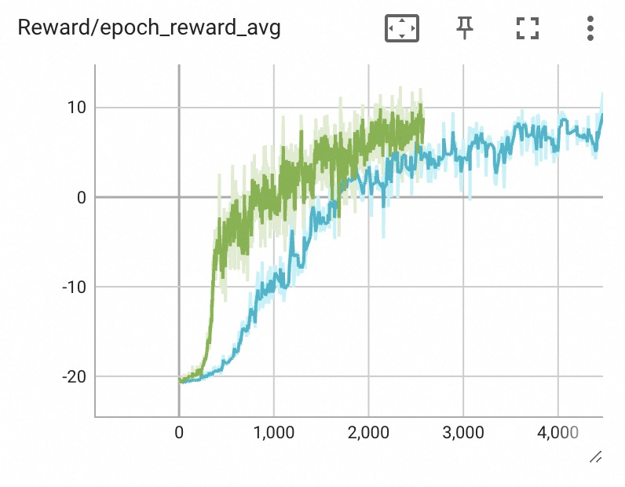

## 为什么做这件事？
1. 尝试结合Transformer在RL领域做一些探索，学习Transformer并探索各种变体（比如gtrxl）；
2. 代码基线，未来针对Transformer变体、其他RL算法进行快速实验；
3. 对于Pong这种在物理规则层面很简单的游戏，模型能否泛化出一些通用能力，甚至学习到物理规则？

## 有了最牛ppo算法，为什么还要做早期policy gradient算法？
早期的policy gradient算法，能力确实不强，但理论学习可以加深理解，特别是RL环境状态随着策略不断变化的状态分布的理解，它与一些传统模型的固定数据集状态分布有很大不同。

## 训练效果

针对 mlp、cnn、cnn3d、cnn3d2d、transformer 等模型进行在Pong游戏上训练对比
* mlp：mlp网络
* cnn：cnn网络
* cnn3d：添加deep维度，使用conv3d，以捕捉运动轨迹
* cnn3d2d：结合conv3d、conv2d，将特征concat到一起
* transformer：使用transformer提取特征

之前做过一些实验备忘[rl-old](https://github.com/jfojfo/rl-old)、 [Transformer学习](https://github.com/jfojfo/ml-learning/blob/master/Transformer%E5%AD%A6%E4%B9%A0.md)

### policy gradient(无value函数)

总体而言，训练时间很长，GTX 1070 GPU上训练1天

【mlp模型】policy损失函数 `loss=sum(log_probs * reward)`，能达到10分
* 黑线：loss除以step数
* 蓝线：loss除以round数，效果好一些

【cnn模型】loss除以round数，没有mlp好

【cnn3d模型】对比mlp，从step看爬升很快，从训练时间看差别不大，得分看上去在0徘徊

| cnn3d | cnn3d vs mlp(steps对比) | cnn3d vs mlp(relative time对比) |
|----|----|----|
|  | |  |

【cnn3d2d模型】
结合cnn3d、cnn，将特征concat到一起。看上去同时获取到了cnn3d的快速起步，也保持了cnn的得分

绿线cnn3d2d，蓝线mlp

【cnn3d minibatch 失败】

pg算法不能重复optimise，也不能分成minibatch，每个minibatch单独optimise，会失败：

| 失败1：重复optimise多次 | 失败2：每批minibatch单独optimise |
|----|----|
|  | |

### policy gradient(有value函数)

actor-critic，critic预测得分

【cnn3d】比没有value函数时起步更快

### ppo

使用ppo后，训练速度明显加快，2小时差不多训练好

【mlp】得分不好

[wandb](https://wandb.ai/jfojfo/pg.episode.ppo.mlp/runs/nyoqfptu)

【cnn】

【cnn3d】

[wandb](https://wandb.ai/jfojfo/pg.episode.ppo.mlp/runs/meo6tnmj?workspace=user-jfojfo)

* 黑线：minibatch取1/16样本，后期得分略高
* 蓝线：minibatch取1/64样本，前期上分速度更快

### ppo with transformer

transformer输入数据序列长度，等于lookback长度再加1个当前状态

| lookback 10 | 序列长度256([wandb](https://wandb.ai/jfojfo/pg.episode.ppo.transformer/runs/wc75ve4z?workspace=user-jfojfo)) |
|----|----|
|  |  |

序列长度256训练时间有限，没有训练更多steps

## 实现说明
网上常见ppo算法实现，一般采样固定步数的数据，由于无法提前得知最终得分，使用贝尔曼方程基于下一个状态、当前reward，打折后计算出当前状态的得分值，进行值函数训练，进而辅助策略函数训练。之前在这个Github库[rl-old](https://github.com/jfojfo/rl-old) 做过一些实验。

这个版本我们没有这样实现，而是先采样n个episode的完整数据再进行训练，一方面是因为早期policy gradient算法的需要，另一方面考虑到Transformer通常需要较长时序数据，可能更贴合未来对Transformer的探索。

对于discount reward需要说明一下，目前采用round reward进行discount，针对的是每一局，而不是整个episode，这对Pong游戏是合理的，每得1分或-1分就是一局

使用policy_gradient.py算法训练时，使用round更容易得到足够多的样本，保证无偏训练。

基于以下模型进行了实验，见「训练效果」：
* mlp：mlp网络
* cnn：cnn网络
* cnn3d：添加deep维度，使用conv3d，以捕捉运动轨迹
* cnn3d2d：结合conv3d、conv2d，将特征concat到一起
* transformer：使用transformer提取特征

用policy gradient训练时，mlp、cnn网络对前后相邻state相减，将diff作为输入，cnn3d网络已经包含state sequence，不用diff

### policy_gradient.py：
纯policy优化（无value函数），基本思路是最大化得分期望函数J。采样一次后数据只能梯度优化一次，因为得分期望是看整体，样本越多越好，样本少了会偏离

$$
\nabla_\theta J(\theta) = \frac{1}{N} \sum_{i=1}^{N} [(\sum_{t=1}^T \nabla_\theta log \pi_\theta (a_{i,t}|s_{i,t})) (\sum_{t=1}^T r(s_t, a_t))]
$$

### actor_critic.py：
在policy_gradient.py基础上，添加值函数，计算advantage进行actor policy优化。
根据理论，用advantage替代reward是一种无偏替换，能降低variance

### ppo.py：
ppo算法，采样后重复10次优化，每次使用1/64的minibatch梯度更新，由于ppo对新策略的probability ratio更新有clip，限制住了新策略的偏离程度，在这个前提下，优化次数越多可以让策略更新越充分，上分速度就越快

### ppo_trans.py：
在ppo.py基础上，添加Transformer模型，并进行了优化，大大提升训练速度。（前面所有能力及代码重构，最终全部集成在ppo_trans.py）

#### inference优化
收集episode数据期间，需要与环境交互，每走一步需要一次inference给出action，而每次inference都涉及到整个sequence的计算。

假设lookback=256，加上当前1个状态，sequence长度为257，计算K、V时的输入sequence长度就是257，计算Q的输入可以只用当前状态，sequence长度为1，为了得到Q、K、V总共需要257*2+1=515次linear计算。下一步inference时再算一次整个序列。

仔细观察可以发现，这两步计算K、V有很多重复：
前一步状态序列$` S_{n-256:n} `$，后一步状态序列$` S_{n+1-256:n+1} `$，其中$` S_{n+1-256:n} `$状态序列是重复的

所以这里可以做一个优化：缓存历史K、V，每次只计算当前state的Q、K、V，然后将结果与缓存拼接成完整K、V，优化后只需要3次linear计算，极大减少了计算量

#### train优化
train阶段为了提升速度，我们选取的是连续step的minibatch，假设minibatch数量为1000，lookback=256，整体sequence长度为256+1000=1256，而随机选取需要训练的数据量为1000*(256+1)=257000，两者差了200多倍！minibatch样本数量越多差距越大

再进一步观察，Q、K计算attention时，$` QK^T `$ 涉及1256*1256次向量相乘，然而attention中每一行，我们关注的仅仅是当前位置与前面256个位置的结果（如下图所示），所以很自然想到sliding window减少计算，使用[local_attention](https://github.com/lucidrains/local-attention)优化，设置window_size=256

### ppo_ref.py：
参考的网上常见ppo实现方式，添加了一下对state image的normalize处理。

关键点：每次采样256 steps数据，计算discount advantage，对advantage做normalize，对数据样本重复训练10次，每次随机采样 1/64 minibatch 进行backward optimise

## 一些实现技巧的个人理解

### 关于Variance 方差：
Q(s,a1)得10分，Q(s,a2)得5分，a1、a2都会正向推动，但a1推得更厉害，使得a1的概率比a2大，但这样梯度会越变越小收敛效率降低，更合适的做法对a1正向推动，对a2反向推动，以减少variance

### 因果性
当对某一时刻策略 $` \pi_\theta(s_t,a_t) `$ 梯度更新时，赋予它的权重改为时刻t及之后的reward之和 $` \sum r_{t:} `$，而不是整条轨迹的reward之和，相当于权重减少 $` \sum r_{1:t-1} `$

也很好理解，相当于t时刻之后的所有 Q(s,a) 全部减少了一个固定值，variance减少

### discount_reward及normalize
具体实现：karpathy.pong.py 和 policy_gradient.py。

注意，对pong这个游戏，discount_reward()在每一回合结束时都对累计reward置0，这么做相当于将round当做episode，可以有效增大样本数，样本越多平均得分期望才有效

### 得分全部-1，discount_reward+normalize后，前半部分数值变为大于0，会得到鼓励，如何理解？
关键字：「相对」
Q(s,a1)虽然增大了a1的logits，但如果s状态有另一个a2，Q(s,a2)对a2的logits增加得更多，这样相对而言a1概率是降低的。

### __discount_reward 和 normalize 要合在一起用。__

考虑以下数据：

1. 第一轮走了10步，得分-1分，discount rewards为 [-0.91, ..., -1]；
2. 第二轮走了20步，得分-1分，discount rewards为 [-0.826, ..., -1]；

1的平均值比2的平均值小，normalize之后2的高度更高，相对于1，2的前面步骤获得更多鼓励，相当于鼓励了steps数更多的策略，实际训练过程印证了这一点。

另外：一个episode 20次得分-1，1次得分1，normalize之后得分1的序列会被推高很多，意味着这次稀缺的得分1策略会被更多强化

## TODO
1. discount reward序列从round改成episode
2. 尝试DecisionTransformer训练
